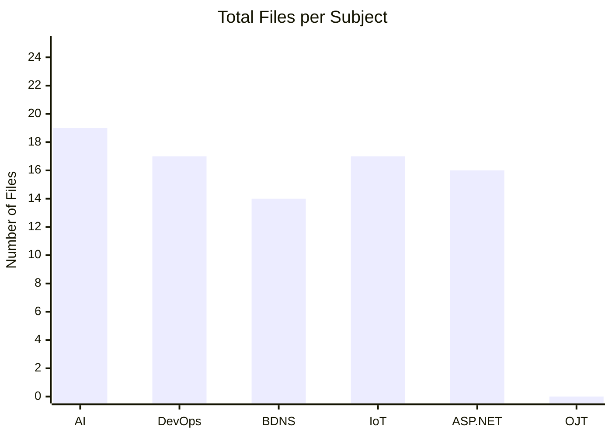
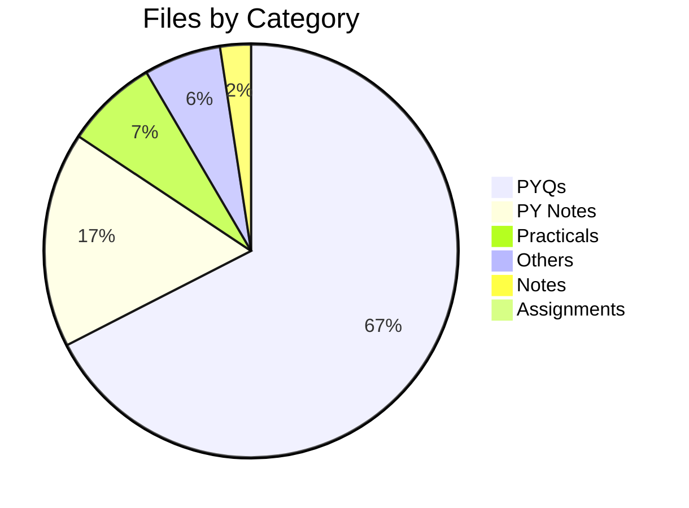
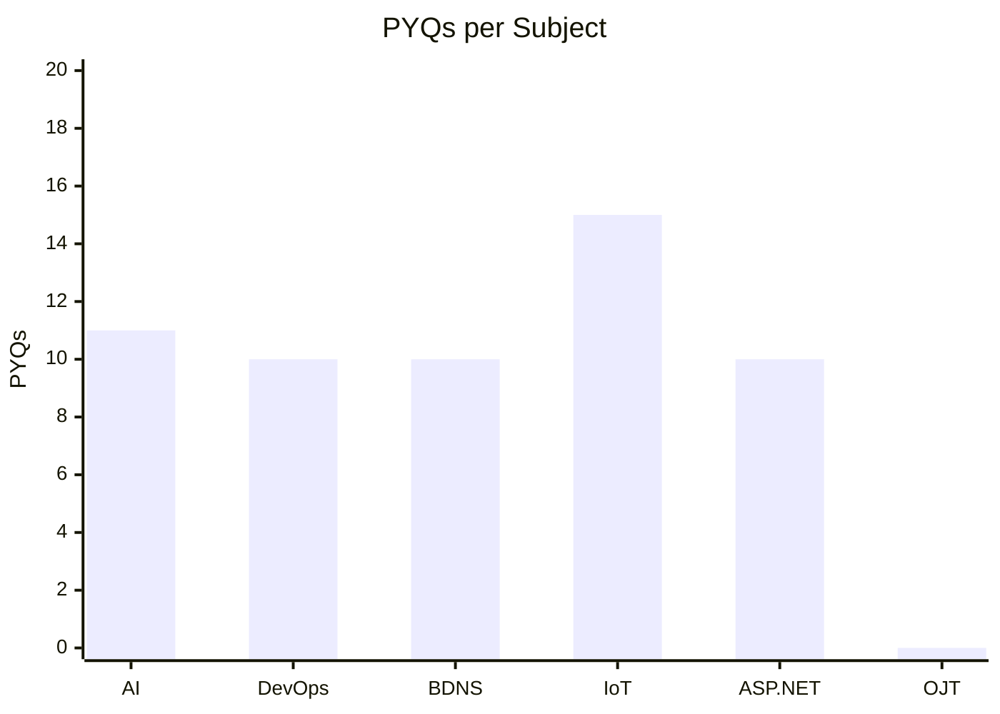
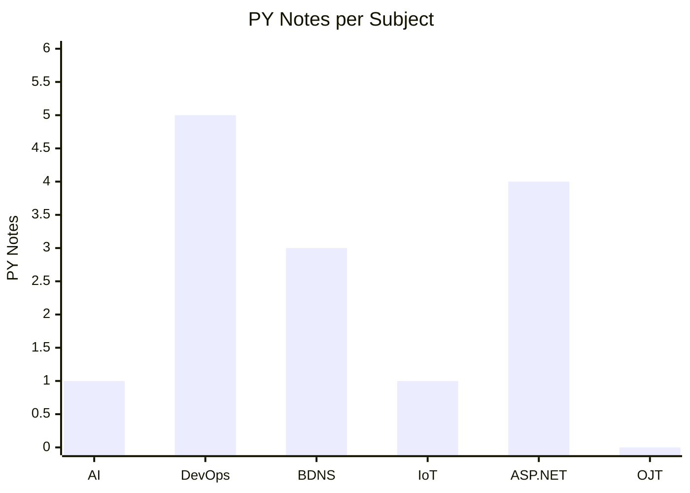

# 📚 TYIT Semester 5 — Study Material Index

> Navigation guide for all subjects, practicals, notes, assignments, PYQs, and other resources.

---

## 📋 Table of Contents

1. [AI — Artificial Intelligence](#1-ai--artificial-intelligence)
2. [DevOps](#2-devops)
3. [BDNS — Big Data & NoSQL](#3-bdns--big-data--nosql)
4. [IoT — Internet of Things](#4-iot--internet-of-things)
5. [ASP.NET](#5-aspnet)
6. [OJT — On Job Training](#6-ojt--on-job-training)

---

## 📊 Dashboard

> Live snapshot of all uploaded resources across subjects. Total: **83 files** across 6 subjects.

### 📦 Files per Subject

### 🗂️ Files by Category

### 📈 Category Breakdown per Subject

### 📋 Full Breakdown Table

| Subject | 🔬 Practicals | 📝 Notes | 📓 PY Notes | 📌 Assignments | 📄 PYQs | 📂 Others | 📦 Total |
|---------|:------------:|:--------:|:-----------:|:--------------:|:-------:|:---------:|:--------:|
| AI | 4 | 2 | 1 | 0 | 11 | 1 | **19** |
| DevOps | 0 | 0 | 5 | 0 | 10 | 2 | **17** |
| BDNS | 0 | 0 | 3 | 0 | 10 | 1 | **14** |
| IoT | 1 | 0 | 1 | 0 | 15 | 0 | **17** |
| ASP.NET | 1 | 0 | 4 | 0 | 10 | 1 | **16** |
| OJT | 0 | 0 | 0 | 0 | 0 | 0 | **0** |
| **Total** | **6** | **2** | **14** | **0** | **56** | **5** | **83** |

---

## 1. AI — Artificial Intelligence

### 🔬 Practicals

| # | Topic | Files |
|---|-------|-------|
| 1 | BFS & DFS Search Algorithms | [BFS Code](AI/Practicals/practical%201/code1-bfs.py) · [BFS Output](AI/Practicals/practical%201/code1-bfs-output.txt) · [DFS Code](AI/Practicals/practical%201/code2-dfs.py) · [DFS Output](AI/Practicals/practical%201/code2-dfs-output.txt) |

### 📝 Notes

| Topic | File |
|-------|------|
| Unit 1 - Introduction | [Unit-1-Chapter-1-Introduction.pdf](AI/Notes/Unit-1-Chapter-1-Introduction.pdf) |
| Chapter 2 - Intelligent Agent | [Chapter-2-Intelligent-Agent.pdf](AI/Notes/Chapter-2-Intelligent-Agent.pdf) |

### 📓 PY Notes

| Unit | File |
|------|------|
| Unit 2 | [AI\_Unit\_2\_Notes.pdf](AI/PY%20Notes/AI_Unit_2_Notes.pdf) |

### 📌 Assignments

> _Assignments coming soon_

### 📄 PYQs

#### External

| Year | File |
|------|------|
| 2018-2019 | [Artificial Intelligence (Oct 2018)](AI/PYQs/External/2018-2019/T.Y.B.Sc.%20In%20Information%20Technology%20(Choice%20Based%20)%20Semester%20-%20V%20%2053704%20-%20Artificial%20Intelligence.pdf) |
| 2019-2020 | [Artificial Intelligence (Nov 2019)](AI/PYQs/External/2019-2020/Subject%20Code_%2053704%20_%20Artificial%20Intelligence.pdf) |
| 2022-2023 | [Artificial Intelligence](AI/PYQs/External/2022-2023/Artificial%20Intelligence.pdf) |
| 2023-2024 | [IT05AI251023](AI/PYQs/External/2023-2024/IT05AI251023.pdf) |
| 2024-2025 | [IT05AI081024](AI/PYQs/External/2024-2025/IT05AI081024.pdf) · [IT05AI121224 (ATKT Dec 2024)](AI/PYQs/External/2024-2025/IT05AI121224.pdf) · [IT05AIIA081024](AI/PYQs/External/2024-2025/IT05AIIA081024.pdf) |
| 2025-2026 | [Artificial Intelligence (Regular)](AI/PYQs/External/2025-2026/Artificial%20intelligence.pdf) |

#### Internal

| Year | File |
|------|------|
| 2024-2025 | [IT05AIIA120824 Set1](AI/PYQs/Internal/2024-2025/IT05AIIA120824_Set1.pdf) · [IT05AIIA051224 (ATKT Dec 2024)](AI/PYQs/Internal/2024-2025/IT05AIIA051224.pdf) |
| 2025-2026 | [AI Internal Exam July 2025](AI/PYQs/Internal/2025-2026/Artificial%20Intelligence%20TY%20B.Sc.%20Information%20Technology%20SEM%20V%20Reg.%20Internal%20Exam%20July%202025.pdf) |

### 📂 Others

| File | Description |
|------|-------------|
| [AI.pdf](AI/Others/AI.pdf) | AI Reference Material |

---

## 2. DevOps

### 🔬 Practicals

> _Practicals coming soon_

### 📝 Notes

> _Notes coming soon_

### 📓 PY Notes

| Unit | File |
|------|------|
| General Notes | [DevOps\_General\_Notes.pdf](DevOps/PY%20Notes/DevOps_General_Notes.pdf) |
| Unit 2 | [DevOps\_Unit\_2\_Notes.pdf](DevOps/PY%20Notes/DevOps_Unit_2_Notes.pdf) |
| Unit 2 (Short) | [DevOps\_Unit\_2\_Short\_Notes.pdf](DevOps/PY%20Notes/DevOps_Unit_2_Short_Notes.pdf) |
| Unit 3 & 4 | [DevOps\_Unit\_3\_4\_Notes.pdf](DevOps/PY%20Notes/DevOps_Unit_3_4_Notes.pdf) |
| Unit 4 & 5 | [DevOps\_Unit\_4\_5\_Notes.pdf](DevOps/PY%20Notes/DevOps_Unit_4_5_Notes.pdf) |

### 📌 Assignments

> _Assignments coming soon_

### 📄 PYQs

#### External

| Year | File |
|------|------|
| 2023-2024 | [IT05DEVOPS191023](DevOps/PYQs/External/2023-2024/IT05DEVOPS191023.pdf) |
| 2024-2025 | [IT05DevOps071024](DevOps/PYQs/External/2024-2025/IT05DevOps071024.pdf) · [IT05DevOps111224 (ATKT Dec 2024)](DevOps/PYQs/External/2024-2025/IT05DevOps111224.pdf) · [IT05DevopsIA071024](DevOps/PYQs/External/2024-2025/IT05DevopsIA071024.pdf) |
| 2025-2026 | [DevOps (Regular)](DevOps/PYQs/External/2025-2026/DevOps.pdf) · [DevOps ATKT Dec 2025](DevOps/PYQs/External/2025-2026/DevOps%20TYBSCIT%20SEM%20V%20Autonomous%20ATKT%20External%20Exam%20December%202025.pdf) |

#### Internal

| Year | File |
|------|------|
| 2024-2025 | [IT05DevOps120824IA SetA](DevOps/PYQs/Internal/2024-2025/IT05DevOps120824IA_SetA.pdf) · [IT05DevopsIA111224 (ATKT Dec 2024)](DevOps/PYQs/Internal/2024-2025/IT05DevopsIA111224.pdf) |
| 2025-2026 | [DevOps Internal Exam July 2025](DevOps/PYQs/Internal/2025-2026/DevOps%20TY%20B.Sc.%20Information%20Technology%20SEM%20V%20Reg.%20Internal%20Exam%20July%202025.pdf) · [DevOps ATKT Internal Dec 2025](DevOps/PYQs/Internal/2025-2026/DevOps%20TYBSCIT%20SEM%20V%20Autonomous%20ATKT%20Internal%20Exam%20December%202025.pdf) |

### 📂 Others

| File | Description |
|------|-------------|
| [The DevOps Adoption Playbook](DevOps/Others/Wiley_The_DevOps_Adoption_Playbook_1119308747.pdf) | DevOps Reference Book (Wiley) |

---

## 3. BDNS — Big Data & NoSQL

### 🔬 Practicals

> _Practicals coming soon_

### 📝 Notes

> _Notes coming soon_

### 📓 PY Notes

| Unit | File |
|------|------|
| Unit 1 | [BDNS\_Unit\_1\_Notes.pdf](BDNS/PY%20Notes/BDNS_Unit_1_Notes.pdf) |
| Unit 2 | [BDNS\_Unit\_2\_Notes.pdf](BDNS/PY%20Notes/BDNS_Unit_2_Notes.pdf) |
| Unit 2 & 3 | [BDNS\_Unit\_2\_3\_Notes.pdf](BDNS/PY%20Notes/BDNS_Unit_2_3_Notes.pdf) |

### 📌 Assignments

> _Assignments coming soon_

### 📄 PYQs

#### External

| Year | File |
|------|------|
| 2023-2024 | [IT05BDNS231023](BDNS/PYQs/External/2023-2024/IT05BDNS231023.pdf) |
| 2024-2025 | [IT05BDNS101024](BDNS/PYQs/External/2024-2025/IT05BDNS101024.pdf) · [IT05BDNS141224 (ATKT Dec 2024)](BDNS/PYQs/External/2024-2025/IT05BDNS141224.pdf) · [IT05BDNSIA101024](BDNS/PYQs/External/2024-2025/IT05BDNSIA101024.pdf) |
| 2025-2026 | [Big Data and NOSQL (Regular)](BDNS/PYQs/External/2025-2026/Big%20Data%20and%20NOSQL.pdf) · [Big Data ATKT Dec 2025](BDNS/PYQs/External/2025-2026/Big%20Data%20and%20NOSQL%20TYBSCIT%20SEM%20V%20Autonomous%20ATKT%20External%20Exam%20December%202025.pdf) |

#### Internal

| Year | File |
|------|------|
| 2024-2025 | [IT05BDNSIA14082024 Set A](BDNS/PYQs/Internal/2024-2025/IT05BDNSIA14082024Autonomous%20-%20Set%20A.pdf) · [IT05BDNSIA141224 (ATKT Dec 2024)](BDNS/PYQs/Internal/2024-2025/IT05BDNSIA141224.pdf) |
| 2025-2026 | [Big Data Internal Exam July 2025](BDNS/PYQs/Internal/2025-2026/Big%20Data%20and%20NOSQL%20TY%20B.Sc.%20Information%20Technology%20SEM%20V%20Reg.%20Internal%20Exam%20July%202025.pdf) · [Big Data ATKT Internal Dec 2025](BDNS/PYQs/Internal/2025-2026/Big%20Data%20and%20NOSQL%20TYBSCIT%20SEM%20V%20Autonomous%20ATKT%20Internal%20Exam%20December%202025.pdf) |

### 📂 Others

| File | Description |
|------|-------------|
| [practical_mongodb.pdf](BDNS/Others/practical_mongodb.pdf) | MongoDB Practical Reference |

---

## 4. IoT — Internet of Things

### 🔬 Practicals

| # | Topic | Files |
|---|-------|-------|
| 0 | Installation Guide | [Practical\_0\_Installation.pdf](IoT/Practicals/Practical_0_Installation.pdf) |

### 📝 Notes

> _Notes coming soon_

### 📓 PY Notes

| Unit | File |
|------|------|
| General Notes | [IoT\_General\_Notes.pdf](IoT/PY%20Notes/IoT_General_Notes.pdf) |

### 📌 Assignments

> _Assignments coming soon_

### 📄 PYQs

#### External

| Year | File |
|------|------|
| 2018-2019 | [Internet of Things (Oct 2018)](IoT/PYQs/External/2018-2019/T.Y.B.Sc.%20In%20Information%20Technology%20(Choice%20Based%20)%20Semester%20-%20V%20%2053702%20%20Internet%20of%20Things.pdf) |
| 2019-2020 | [Internet of Things (Nov 2019)](IoT/PYQs/External/2019-2020/Subject%20Code_%2053702%20_%20Internet%20of%20Things.pdf) |
| 2022-2023 | [Internet of Things](IoT/PYQs/External/2022-2023/Internet%20of%20Things.pdf) |
| 2023-2024 | [IT05IOT211023](IoT/PYQs/External/2023-2024/IT05IOT211023.pdf) |
| 2024-2025 | [IT05IoT091024](IoT/PYQs/External/2024-2025/IT05IoT091024.pdf) · [IT05IoT091024 (23-24)](IoT/PYQs/External/2024-2025/IT05IoT091024(23-24).pdf) · [IT05IOT131224 (ATKT Dec 2024)](IoT/PYQs/External/2024-2025/IT05IOT131224.pdf) · [IT05IOT131224 (23-24)](IoT/PYQs/External/2024-2025/IT05IOT131224(2023-24).pdf) · [IT05IoTIA091024](IoT/PYQs/External/2024-2025/IT05IoTIA091024.pdf) |
| 2025-2026 | [Internet of Things (Regular)](IoT/PYQs/External/2025-2026/Internet%20of%20Things.pdf) · [IoT ATKT Dec 2025](IoT/PYQs/External/2025-2026/Internet%20of%20Things%20TYBSCIT%20SEM%20V%20Autonomous%20ATKT%20External%20Exam%20December%202025.pdf) |

#### Internal

| Year | File |
|------|------|
| 2024-2025 | [IT05IoT130824IA SetA](IoT/PYQs/Internal/2024-2025/IT05IoT130824IA_SetA.pdf) · [IT05IoTIA131224](IoT/PYQs/Internal/2024-2025/IT05IoTIA131224.pdf) · [IT05IoTIA131224 (23-24)](IoT/PYQs/Internal/2024-2025/IT05IoTIA131224%20(2023-24).pdf) |
| 2025-2026 | [IoT Internal Exam July 2025](IoT/PYQs/Internal/2025-2026/Internet%20of%20Things%20TY%20B.Sc.%20Information%20Technology%20SEM%20V%20Reg.%20Internal%20Exam%20July%202025.pdf) |

### 📂 Others

> _Other resources coming soon_

---

## 5. ASP.NET

### 🔬 Practicals

| # | Topic | Files |
|---|-------|-------|
| 1 | Practical 1 | [practical1.pdf](ASP.NET/Practicals/practical1.pdf) |

### 📝 Notes

> _Notes coming soon_

### 📓 PY Notes

| Unit | File |
|------|------|
| Unit 1 | [ASPNET\_Unit\_1\_Notes.pdf](ASP.NET/PY%20Notes/ASPNET_Unit_1_Notes.pdf) |
| Unit 2 | [ASPNET\_Unit\_2\_Notes.pdf](ASP.NET/PY%20Notes/ASPNET_Unit_2_Notes.pdf) |
| Unit 3 & 4 | [ASPNET\_Unit\_3\_4\_Notes.pdf](ASP.NET/PY%20Notes/ASPNET_Unit_3_4_Notes.pdf) |
| Unit 4 | [ASPNET\_Unit\_4\_Notes.pdf](ASP.NET/PY%20Notes/ASPNET_Unit_4_Notes.pdf) |

### 📌 Assignments

> _Assignments coming soon_

### 📄 PYQs

#### External

| Year | File |
|------|------|
| 2023-2024 | [IT05ASPNET201023](ASP.NET/PYQs/External/2023-2024/IT05ASPNET201023.pdf) |
| 2024-2025 | [IT05ASP111024](ASP.NET/PYQs/External/2024-2025/IT05ASP111024.pdf) · [IT05ASP161224 (ATKT Dec 2024)](ASP.NET/PYQs/External/2024-2025/IT05ASP161224.pdf) · [IT05ASPIA111024](ASP.NET/PYQs/External/2024-2025/IT05ASPIA111024.pdf) |
| 2025-2026 | [ASP.NET Core (Regular)](ASP.NET/PYQs/External/2025-2026/ASP.NET%20Core.pdf) · [ASP.NET Core ATKT Dec 2025](ASP.NET/PYQs/External/2025-2026/ASP%20.NET%20Core%20TYBSCIT%20SEM%20V%20Autonomous%20ATKT%20External%20Exam%20December%202025.pdf) |

#### Internal

| Year | File |
|------|------|
| 2024-2025 | [IT05ASPIA140824 Set1](ASP.NET/PYQs/Internal/2024-2025/IT05ASPIA140824_Set1.pdf) · [IT05ASPIA161224 (ATKT Dec 2024)](ASP.NET/PYQs/Internal/2024-2025/IT05ASPIA161224.pdf) |
| 2025-2026 | [ASP.NET Core Internal Exam July 2025](ASP.NET/PYQs/Internal/2025-2026/ASP.NET%20Core%20TY%20B.Sc.%20Information%20Technology%20SEM%20V%20Reg.%20Internal%20Exam%20July%202025.pdf) · [ASP.NET Core ATKT Internal Dec 2025](ASP.NET/PYQs/Internal/2025-2026/ASP%20.NET%20Core%20TYBSCIT%20SEM%20V%20Autonomous%20ATKT%20Internal%20Exam%20December%202025.pdf) |

### 📂 Others

| File | Description |
|------|-------------|
| [Pro ASP.NET Core 6 — Adam Freeman (Apress, 9th Ed.)](ASP.NET/Others/Pro.ASP.NET.Core.6.9th.Edition.Adam.Freeman.Apress.9781484279564.EBooksWorld.ir.pdf) | Reference Book |

---

## 6. OJT — On Job Training

### 🔬 Practicals

> _Practicals coming soon_

### 📝 Notes

> _Notes coming soon_

### 📓 PY Notes

> _PY Notes coming soon_

### 📌 Assignments

> _Assignments coming soon_

### 📄 PYQs

> _PYQs coming soon_

### 📂 Others

> _Other resources coming soon_

---

> 💡 **Tip:** As new files are added to the repo, update the tables above with links to keep navigation easy.
